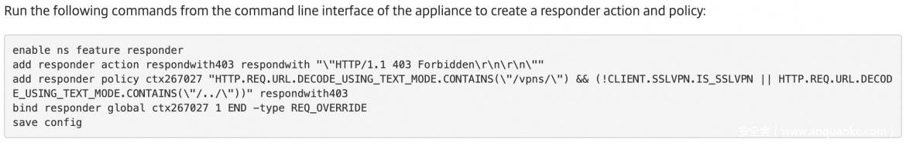
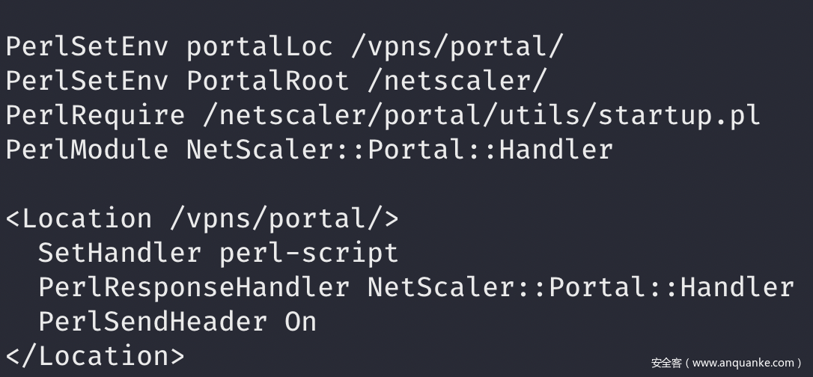
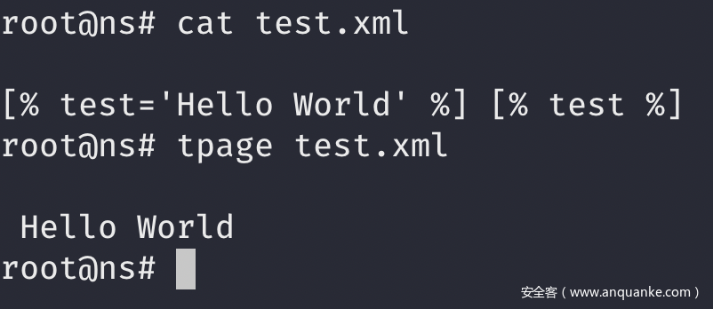
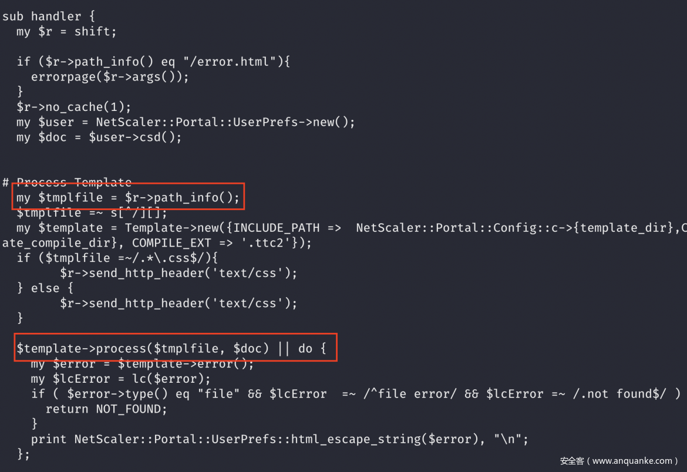
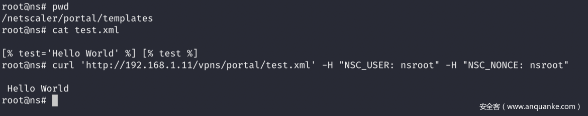

# CVE-2019-19781：深入分析Citrix ADC RCE漏洞

## 前言

Citrix ADC及Citrix Gateway上个月被曝存在一个严重漏洞，编号为CVE-2019-19781。我们比较关注该漏洞，据称未经身份认证的攻击者可以利用该漏洞攻击目标设备。虽然Positive Technologies和Paddy Power Betfair最早公布了漏洞信息，但并没有公开利用该漏洞的方式，因此需要进一步研究。

## 漏洞分析

尽管之前没有公开关于该漏洞的利用方式，但我们还是可以在Citrix的安全公告中找到关于漏洞类型的蛛丝马迹。



从该信息中，我们可知漏洞点可能位于/vpns/路径中，并且可能是一个目录遍历漏洞。了解这一点后，我们开始在httpd.conf文件中寻找/vpns的定义，发现/vpn/portal/scripts/由NetScaler::Portal::Handler这个Perl模块（Handler.pm）负责处理。



该目录中包含若干个脚本，但由于这可能是一个目录遍历漏洞，因此我们决定重点关注与文件写入操作有关的任何潜在的代码路径。

最终我们在UsersPrefs Perl模块中找到了如下代码：

```
sub csd {
        my $self = shift;
        my $skip_read = shift || "";
  # Santity Check
    my $cgi = new CGI;
print "Content-type: text/html\n\n";

// Username variable initialized by the NSC_USER HTTP Header
    my $username = Encode::decode('utf8', $ENV{'HTTP_NSC_USER'}) || errorpage("Missing NSC_USER header.”); <- MARK THIS

    $self->{username} = $username;
...
    $self->{session} = %session;

// Constructing the path from the username.
        $self->{filename} = NetScaler::Portal::Config::c->{bookmark_dir} . Encode::encode('utf8', $username) . '.xml’;
        if($skip_read eq 1) {
                return;
        }
```

简而言之，这段代码会直接根据HTTP头部中的NSC_USER字段构建具体路径，没有进行任何过滤操作。因此，调用csd函数的任何脚本都可以触发路径漏洞。

几乎所有脚本都会使用这个函数，然而对我们而言最有趣的是newbm.pl这个脚本文件：

```
my $cgi = new CGI;
print "Content-type: text/html\n\n";
my $user = NetScaler::Portal::UserPrefs->new();
my $doc = $user->csd();
...
my $newurl = Encode::decode('utf8', $cgi->param('url'));
my $newtitle = Encode::decode('utf8', $cgi->param('title'));
my $newdesc = Encode::decode('utf8', $cgi->param('desc'));
my $UI_inuse = Encode::decode('utf8', $cgi->param('UI_inuse'));
...
my $newBM = {   url => $newurl,
    title => $newtitle,
    descr => $newdesc,
    UI_inuse => $UI_inuse,
};
...
```

该脚本会根据多个参数创建一个数组，然后调用filewrite函数，该函数将具体内容写入磁盘上的一个XML文件。

```
if ($newBM->{url} =~ /^\/){
   push @{$doc->{filesystems}->{filesystem}}, $newBM;
 } else { # bookmark
   push @{$doc->{bookmarks}->{bookmark}}, $newBM;
 }
// Writing XML file to disk
 $user->filewrite($doc);
```

因此从本质上来看，现在我们得到了一个部分文件写入原语，可以控制除文件扩展名外的具体路径，也能控制xml文件中的某些内容。如果单凭这个漏洞，我们基本上没啥发挥空间，然而在看到Craig Yong的一篇文章后，我们发现有可能使用Perl Template Toolkit来进一步利用该漏洞。

进一步研究后，我们发现可以在XML文件中插入特定指令，如果模板引擎解析该内容，就有可能实现代码执行。

比如，我们可以通过如下方式来实现模板解析：



再次回到这个漏洞利用过程，现在我们可以使用部分文件写入原语来注入Perl Template Toolkit指令，但仍需要找到一种方法，强制脚本解析模板。

寻找涉及到模板操作的所有代码后，我们找到了Handler.pm模块：



其中$tmplfile变量来自于HTTP请求路径，并且代码会创建一个新的模板，解析该文件。

将前面我们创建的test.xml文件拷贝到模板目录中，我们就可以触发模板解析操作。



总结一下，为了利用该漏洞，我们需要执行如下操作：

1、找到通过模板执行Perl代码的方法；

2、使用路径遍历漏洞将构造的XML文件写入模板目录；

3、浏览上传的XML文件，触发模板解析。

最后还有一个点没解决，那就是使用模板来执行任意命令。在默认配置下，这似乎是“不可能”完成的一个任务。然而实际上Citrix有一个未公开的功能，可以用来执行任意perl代码，但目前我们还不准备公开该技术。根据本文提供的这些信息，有经验的安全团队应该可以复现该问题，但还需要一定研究才能实现代码执行。

由于该漏洞会影响众多设备，因此MDSec决定不公开该漏洞的现成利用代码，但我们发现有一些攻击者现在已经在使用该漏洞，因此我们认为有必要公开我们的研究成果，以便其他小伙伴能及时行动起来。

## 缓解措施

Citrix公开了缓解措施，以便阻止攻击者利用该漏洞，大家可参考CVE-2019-19781的[安全公告，这里我们强烈建议Citrix ADC用户第一时间采取修复措施。

此外，我们还可以监控POST请求。根据@buffaloverflow的提示，如果URL中带有/vpns/及/../字符串，后面跟着一个GET请求，访问以.xml扩展名结尾的文件，那么就可以触发警告。
